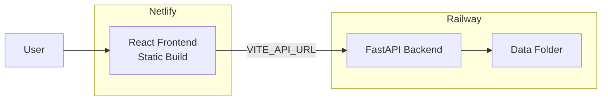

# Deployment Plan: Railway (Backend) + Netlify (Frontend)

## Architecture Overview



## Critical Issue to Fix

The backend's data path calculation in [`backend/src/services.py`](backend/src/services.py) uses a relative path that breaks when containerized:

```python
DATA_DIR = Path(__file__).parent.parent.parent / "data"  # Goes outside container
```

**Solution**: Make `DATA_DIR` configurable via environment variable in [`backend/src/settings.py`](backend/src/settings.py).

---

## 1. Backend Changes (for Railway)

### 1.1 Update Settings

Add configurable data directory to [`backend/src/settings.py`](backend/src/settings.py):

```python
data_dir: str = "/app/data"  # Default for Docker
```

### 1.2 Update Services

Modify [`backend/src/services.py`](backend/src/services.py) to use settings:

```python
from .settings import settings
DATA_DIR = Path(settings.data_dir)
```

### 1.3 Update Dockerfile

Modify [`backend/Dockerfile`](backend/Dockerfile) to:

- Copy data folder from parent context
- Remove `reload=True` for production

This requires changing the Docker build context. Create a root-level Dockerfile for Railway:

```dockerfile
FROM python:3.12-slim
WORKDIR /app
COPY --from=ghcr.io/astral-sh/uv:latest /uv /usr/local/bin/uv
COPY backend/pyproject.toml backend/uv.lock ./
RUN uv sync --frozen
COPY backend/ .
COPY data/ ./data/
EXPOSE 8000
CMD ["uv", "run", "uvicorn", "src.main:app", "--host", "0.0.0.0", "--port", "8000"]
```

### 1.4 Railway Configuration

Create `railway.toml` at repo root:

```toml
[build]
dockerfilePath = "Dockerfile.railway"

[deploy]
healthcheckPath = "/api/projects"
```

### 1.5 Railway Environment Variables

Set in Railway dashboard:

- `CORS_ORIGINS` = `https://your-site.netlify.app` (add after Netlify deploy)
- `PORT` = `8000` (Railway provides this automatically)

---

## 2. Frontend Changes (for Netlify)

### 2.1 Netlify Configuration

Create `netlify.toml` at repo root:

```toml
[build]
  base = "frontend"
  command = "npm run build"
  publish = "dist"

[[redirects]]
  from = "/*"
  to = "/index.html"
  status = 200
```

### 2.2 Netlify Environment Variables

Set in Netlify dashboard (after Railway deploy):

- `VITE_API_URL` = `https://your-app.up.railway.app`

---

## Deployment Order

1. **Push all changes to GitHub**
2. **Deploy Backend on Railway**

   - Connect repo, Railway will auto-detect `railway.toml`
   - Note the generated URL (e.g., `https://dawta-backend.up.railway.app`)

3. **Deploy Frontend on Netlify**

   - Connect repo, Netlify will auto-detect `netlify.toml`
   - Add `VITE_API_URL` with Railway URL
   - Trigger rebuild

4. **Update Railway CORS**

   - Add Netlify URL to `CORS_ORIGINS` in Railway
   - Redeploy backend

---

## Files to Create/Modify

| File | Action |

|------|--------|

| `backend/src/settings.py` | Add `data_dir` setting |

| `backend/src/services.py` | Use settings for `DATA_DIR` |

| `Dockerfile.railway` (new) | Root-level Dockerfile for Railway |

| `railway.toml` (new) | Railway configuration |

| `netlify.toml` (new) | Netlify configuration |