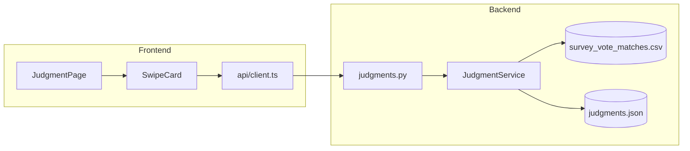

# Survey-Vote Match Judgment Feature

## Overview

A Tinder-style card interface for users to judge EU survey-vote matches. Swipe right (or tap thumbs up) = agree the match is relevant. Swipe left (or tap thumbs down) = disagree.

## Architecture



## Backend Changes

### 1. New router: [`backend/src/routers/judgments.py`](backend/src/routers/judgments.py)

- `GET /judgments/matches` - Returns paginated list of matches from the CSV (question_id, vote_id, question_text, vote_summary, similarity_score)
- `GET /judgments/matches/random` - Returns a random unjudged match for the user
- `POST /judgments` - Submit a judgment (thumbs_up: bool) for a match
- `GET /judgments/stats` - Get aggregated stats (total judgments, agreement rate)

### 2. New model in [`backend/src/models.py`](backend/src/models.py)

```python
class SurveyVoteMatch(BaseModel):
    question_id: str
    vote_id: int
    question_text: str
    vote_summary: str
    similarity_score: float

class Judgment(BaseModel):
    question_id: str
    vote_id: int
    thumbs_up: bool
    timestamp: str
```

### 3. New service: [`backend/src/services.py`](backend/src/services.py)

Add `JudgmentService` class:

- Load matches from CSV (`data/ue-pair-correlation/survey_vote_matches_judged.csv`)
- Store judgments in `data/ue-pair-correlation/judgments.json` with structure:
  ```json
  {
    "QB7_2-153918": {"thumbs_up": 5, "thumbs_down": 2},
    ...
  }
  ```

- Key format: `{question_id}-{vote_id}` for traceability

### 4. Register router in [`backend/src/main.py`](backend/src/main.py)

## Frontend Changes

### 1. New page: [`frontend/src/pages/JudgeSurveyVote.tsx`](frontend/src/pages/JudgeSurveyVote.tsx)

- Mobile-first card layout
- Shows one match at a time (question + vote summary)
- Two large tap zones: thumbs down (left) / thumbs up (right)
- Touch swipe support for mobile
- Progress indicator showing how many judged

### 2. New component: [`frontend/src/components/molecules/SwipeCard.tsx`](frontend/src/components/molecules/SwipeCard.tsx)

- Card with question text and vote summary
- Animated swipe feedback (green/red tint on swipe direction)
- Touch gesture handling

### 3. API client additions in [`frontend/src/api/client.ts`](frontend/src/api/client.ts)

```typescript
export interface SurveyVoteMatch {
  questionId: string;
  voteId: number;
  questionText: string;
  voteSummary: string;
  similarityScore: number;
}

export async function fetchRandomMatch(): Promise<SurveyVoteMatch>
export async function submitJudgment(questionId: string, voteId: number, thumbsUp: boolean): Promise<void>
```

### 4. Route in [`frontend/src/App.tsx`](frontend/src/App.tsx)

Add route: `/projects/ue-pair-correlation/judge`

### 5. Link from project

Add this project to [`data/projects.json`](data/projects.json) with a flag to indicate it has an interactive judgment feature.

## File Storage

Judgments stored in `data/ue-pair-correlation/judgments.json`:

- Keys match CSV rows via `{question_id}-{vote_id}`
- Aggregates thumbs up/down counts (anonymous, no user tracking)